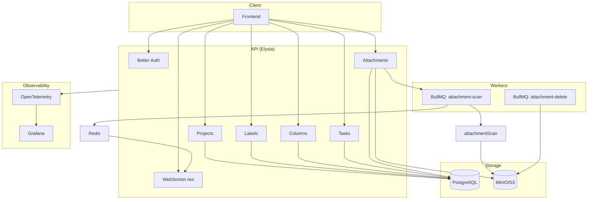

# Axisor Kanban — API

API da aplicação Kanban (Axisor), construída com **Elysia** e **Bun**.

## Tecnologias principais

- **Elysia** — framework HTTP
- **Bun** — runtime e package manager
- **Drizzle** — ORM + migrations (PostgreSQL)
- **Better Auth** — autenticação
- **OpenAPI** — documentação da API (consumida pelo front via Orval)
- **MinIO** — armazenamento de arquivos (S3-compatible)
- **Redis** — pub/sub para WebSockets e filas
- **BullMQ** — filas (scan de anexos, exclusão em lote)
- **Resend** + **React Email** — envio e templates de e-mail
- **OpenTelemetry** — traces para observabilidade (Grafana/OTLP)

## Fluxo principal da aplicação



## Pré-requisitos

- [Bun](https://bun.sh/) — para rodar a API
- [Docker](https://www.docker.com/) e Docker Compose — para subir PostgreSQL, Redis e MinIO

Todo o resto (banco, Redis, armazenamento) é provisionado via **Docker**; não é preciso instalar PostgreSQL, Redis nem MinIO na máquina.

## Setup

1. **Dependências**

   ```bash
   bun install
   ```

2. **Variáveis de ambiente**

   Copie `.env.example` para `.env` e preencha (incluindo `REDIS_URL` se não for `redis://localhost:6379`):

   - `DATABASE_URL`, `POSTGRES_*`, `BETTER_AUTH_*`, `FRONTEND_URL`
   - `RESEND_API_KEY` (Resend)
   - `S3_*` (MinIO: user, password, endpoint, bucket) — os mesmos valores são usados pelo `docker-compose` no serviço MinIO
   - Opcional: `OTEL_EXPORTER_OTLP_ENDPOINT` e `OTEL_EXPORTER_OTLP_HEADERS` para observabilidade

3. **Docker — subir PostgreSQL, Redis e MinIO**

   No diretório da API:

   ```bash
   docker compose up -d
   ```

   O `docker-compose.yml` sobe três serviços:

   | Serviço   | Imagem     | Portas        | Uso |
   |-----------|------------|---------------|-----|
   | **db**    | postgres:18| 5432          | Banco de dados; usa `POSTGRES_USER`, `POSTGRES_PASSWORD`, `POSTGRES_DB` do `.env`. Dados persistem no volume `pgdata`. |
   | **redis** | redis:7    | 6379          | Pub/sub (WebSocket) e filas BullMQ. Sem senha por padrão; a API conecta em `redis://localhost:6379` (ou `REDIS_URL`). |
   | **minio** | minio/minio| 9000 (API), 9001 (console) | Armazenamento S3-compatible. Usa `S3_ROOT_USER` e `S3_ROOT_PASSWORD` do `.env`. Console em `http://localhost:9001`. Dados no volume `minio-data`. |

   O Redis não exige variáveis no compose; o MinIO usa as mesmas credenciais que você coloca em `S3_*` no `.env` para a API se conectar. Depois de subir, crie o bucket configurado em `S3_BUCKET` (pela console do MinIO ou ferramenta S3).

4. **Banco**

   ```bash
   bun run db:generate
   bun run db:migrate
   ```

5. **Rodar a API**

   ```bash
   bun run dev
   ```

   A API sobe em `http://localhost:3333`. Os workers BullMQ (scan e delete de anexos) sobem no mesmo processo. Ela espera que os serviços do Docker (db, redis, minio) já estejam no ar.

## Scripts

| Script          | Descrição                          |
|-----------------|------------------------------------|
| `bun run dev`   | Servidor em modo watch              |
| `bun run test`  | Testes (Vitest, e2e)                |
| `bun run test:migrate` | Aplica migrations no banco de testes (usa `.env.test.local`) |
| `db:generate`   | Gera migrations Drizzle             |
| `db:migrate`    | Aplica migrations                   |
| `db:studio`     | Drizzle Studio                      |

## Testes E2E

Há testes **e2e** (Vitest) cobrindo as rotas da API, **exceto as de attachment** (upload/download/scan):

- **Projects**: create, get, update, delete
- **Labels**: create, get, update, delete
- **Columns**: create, update, delete, reorder
- **Tasks**: create, update, delete, reorder

**Antes de rodar os testes** é preciso ter um banco de testes e aplicar as migrations nele. As variáveis de ambiente dos testes vêm do arquivo `.env.test.local` (ex.: `DATABASE_URL` apontando para um Postgres de teste).

1. Crie `.env.test.local` com as variáveis necessárias para o ambiente de teste (pode copiar do `.env` e alterar `DATABASE_URL` para outro banco, ou usar outro Postgres/container).
2. Gere o banco de testes rodando as migrations:

   ```bash
   bun run test:migrate
   ```

3. Rode os testes:

   ```bash
   bun run test
   ```

## WebSockets e Redis

- **WebSocket**: endpoint `/ws?projectId=<id>`. Clientes são registrados por `projectId`.
- **Redis**: usado como pub/sub. Quando um worker publica em `notifications` (ex.: resultado do scan de anexo), a API repassa a mensagem para todos os clientes WebSocket daquele projeto.
- **BullMQ**: filas `attachment-scan` e `attachment-delete` usam a mesma `REDIS_URL`.

## Filas (BullMQ)

- **attachment-scan**: após upload, o anexo entra na fila; um worker roda o “scan” (simulado), atualiza status no banco e publica no Redis para o front via WS.
- **attachment-delete**: exclusão em lote de objetos no MinIO por `storageKey`.

## Armazenamento (MinIO)

Upload de anexos vai para MinIO (S3-compatible). Leitura é via **URL pré-assinada** (presign) com expiração (ex.: 1h). O scan simulado não usa antivírus real; veja a seção abaixo para simular vírus e erro.

## E-mail (Resend + React Email)

Envios (ex.: confirmação de e-mail via Better Auth) usam **Resend** com templates em **React Email** (`@react-email/components`). Configure `RESEND_API_KEY` no `.env`.

## Observabilidade (Grafana)

A API usa **OpenTelemetry** (`@elysiajs/opentelemetry`) e envia traces para um coletor OTLP. Configure:

- `OTEL_EXPORTER_OTLP_ENDPOINT` (ex.: endpoint do Grafana Alloy ou Otel Collector)
- `OTEL_EXPORTER_OTLP_HEADERS` (ex.: `Authorization=Bearer ...`)

Assim você visualiza traces e métricas no **Grafana**.

## Simulação de scan de anexos (virus / erro)

O “antivírus” é simulado pelo **nome do arquivo**:

- **Arquivo “infectado”**: use um arquivo cujo nome contenha `virus` ou `vírus`. Ex.: enviar um PDF chamado **`virus.pdf`**.
- **Erro de scan**: use um arquivo cujo nome contenha `error`. Ex.: **`error.pdf`** — o worker vai falhar e o status do anexo ficará como erro.

Qualquer outro nome resulta em status **clean**.

---

## Outros pontos

- **CORS**: configurado para `FRONTEND_URL` (ex.: `http://localhost:3000`).
- **OpenAPI**: JSON em `GET /openapi/json`; o front usa **Orval** para gerar cliente e tipos a partir desse spec.
- **Health**: `GET /health` retorna `{ "status": "ok" }`.
